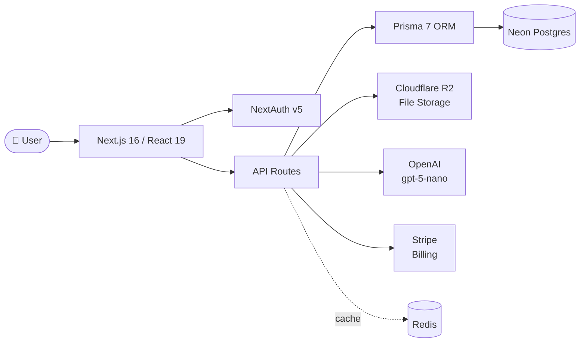
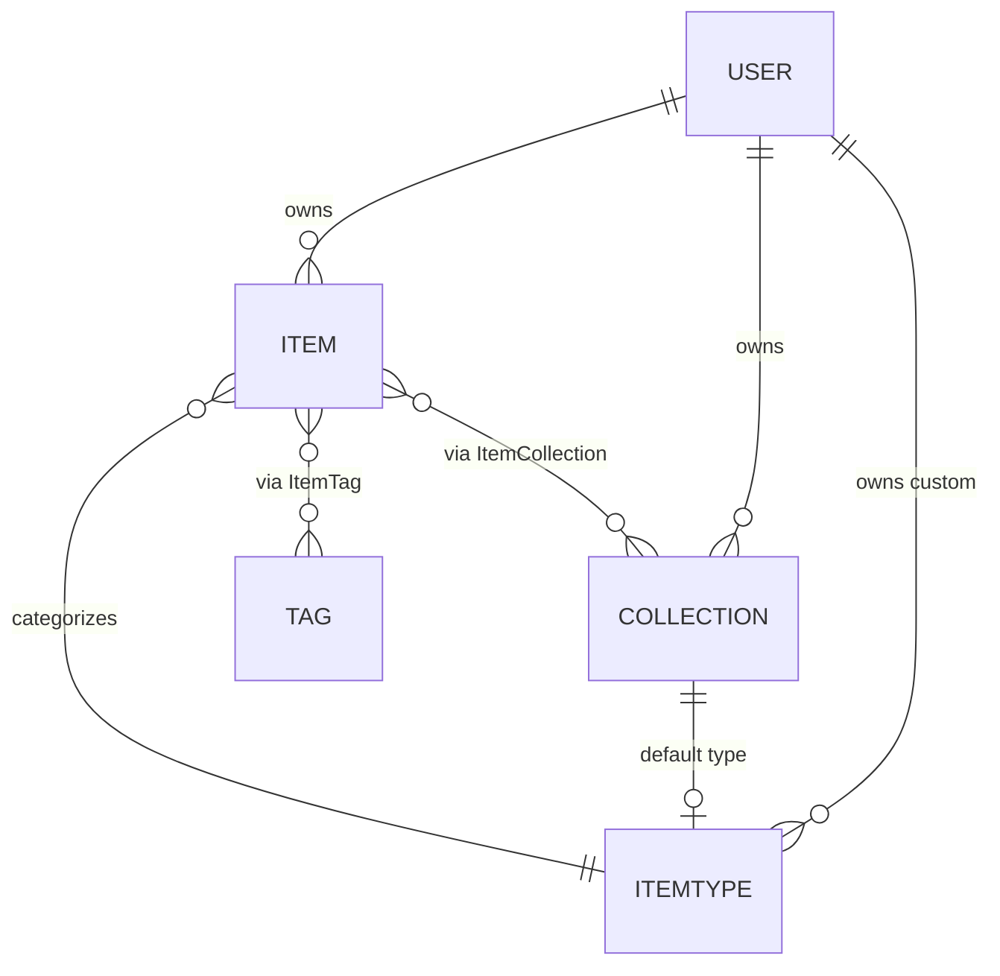

# 📦 DevStash — Project Overview

> **One fast, searchable, AI-enhanced hub for all developer knowledge & resources.**

---

## 🎯 The Problem

Developers keep their essentials scattered across too many tools:

- 💻 Code snippets in VS Code or Notion
- 🤖 AI prompts in chat histories
- 📁 Context files buried in projects
- 🔖 Useful links in bookmarks
- 📚 Docs in random folders
- ⌨️ Commands in `.txt` files
- 🧩 Project templates in GitHub gists
- 🐚 Terminal commands in bash history

This causes **context switching**, **lost knowledge**, and **inconsistent workflows**.

**DevStash** solves this with one unified, fast, AI-enhanced hub.

---

## 👥 Target Users

| User                           | Needs                                              |
| ------------------------------ | -------------------------------------------------- |
| **Everyday Developer**         | Fast access to snippets, prompts, commands, links  |
| **AI-first Developer**         | Save prompts, contexts, workflows, system messages |
| **Content Creator / Educator** | Store code blocks, explanations, course notes      |
| **Full-stack Builder**         | Collect patterns, boilerplates, API examples       |

---

## 🏗️ Core Architecture



---

## ✨ Features

### A. Items & Item Types

Items are the fundamental unit of DevStash. Each item has a **type** that determines how it's stored and rendered.

**System types** (cannot be modified):

| Type    | Icon         | Color               | Storage | Tier    |
| ------- | ------------ | ------------------- | ------- | ------- |
| Snippet | `Code`       | `#3b82f6` (blue)    | text    | Free    |
| Prompt  | `Sparkles`   | `#8b5cf6` (purple)  | text    | Free    |
| Command | `Terminal`   | `#f97316` (orange)  | text    | Free    |
| Note    | `StickyNote` | `#fde047` (yellow)  | text    | Free    |
| Link    | `Link`       | `#10b981` (emerald) | url     | Free    |
| File    | `File`       | `#6b7280` (gray)    | file    | **Pro** |
| Image   | `Image`      | `#ec4899` (pink)    | file    | **Pro** |

Users can create **custom types** later (Pro feature).

- Items live at routes like `/items/snippets`, `/items/prompts`, etc.
- Items open in a **quick-access drawer** for creation and viewing.

### B. Collections

Collections group items by topic, project, or workflow.

- Items can belong to **multiple collections** (e.g., a React snippet in both _React Patterns_ and _Interview Prep_)
- Collections can hold **any item type**
- Each collection has a `defaultTypeId` used when creating items in an empty collection

**Examples:**

- _React Patterns_ (snippets, notes)
- _Context Files_ (files)
- _Python Snippets_ (snippets)

### C. Search

Powerful, fast search across:

- Content body
- Tags
- Titles
- Item types

### D. Authentication

- Email + password
- GitHub OAuth

### E. General Features

- ⭐ Favorite collections and items
- 📌 Pin items to top
- 🕘 Recently used view
- 📥 Import code from a file
- 📝 Markdown editor for text types
- 🗂️ File upload for file/image types
- 📤 Export data in multiple formats
- 🌙 Dark mode (default) + light mode
- 🔗 Add/remove items to multiple collections
- 👁️ View collections an item belongs to

### F. AI Features (Pro)

- 🏷️ Auto-tag suggestions
- 📝 AI summaries
- 💡 "Explain this code"
- ✨ Prompt optimizer

---

## 💾 Data Model

### Entity Relationship



### Prisma Schema (Draft)

```prisma
// schema.prisma

generator client {
  provider = "prisma-client-js"
}

datasource db {
  provider = "postgresql"
  url      = env("DATABASE_URL")
}

model User {
  id                   String    @id @default(cuid())
  email                String    @unique
  name                 String?
  image                String?
  password             String?   // null for OAuth-only users
  emailVerified        DateTime?

  // Pro / billing
  isPro                Boolean   @default(false)
  stripeCustomerId     String?   @unique
  stripeSubscriptionId String?   @unique

  // Relations
  accounts             Account[]
  sessions             Session[]
  items                Item[]
  collections          Collection[]
  itemTypes            ItemType[] // user's custom types
  tags                 Tag[]

  createdAt            DateTime  @default(now())
  updatedAt            DateTime  @updatedAt
}

model Item {
  id          String   @id @default(cuid())
  title       String
  description String?

  // Content storage (one of these will be populated)
  contentType ContentType  // TEXT | FILE | URL
  content     String?      // text body (snippet, prompt, note, command)
  fileUrl     String?      // R2 URL
  fileName    String?
  fileSize    Int?         // bytes
  url         String?      // for link types

  // Metadata
  language    String?      // optional language for code (e.g., "ts", "py")
  isFavorite  Boolean      @default(false)
  isPinned    Boolean      @default(false)

  // Relations
  userId      String
  user        User         @relation(fields: [userId], references: [id], onDelete: Cascade)
  itemTypeId  String
  itemType    ItemType     @relation(fields: [itemTypeId], references: [id])
  collections ItemCollection[]
  tags        ItemTag[]

  createdAt   DateTime     @default(now())
  updatedAt   DateTime     @updatedAt

  @@index([userId])
  @@index([itemTypeId])
}

model ItemType {
  id       String  @id @default(cuid())
  name     String
  icon     String  // lucide icon name e.g., "Code"
  color    String  // hex string
  isSystem Boolean @default(false)

  userId   String? // null for system types
  user     User?   @relation(fields: [userId], references: [id], onDelete: Cascade)

  items        Item[]
  defaultForCollections Collection[] @relation("CollectionDefaultType")

  @@unique([userId, name])
}

model Collection {
  id            String   @id @default(cuid())
  name          String
  description   String?
  isFavorite    Boolean  @default(false)

  // Default type used when creating items in an empty collection
  defaultTypeId String?
  defaultType   ItemType? @relation("CollectionDefaultType", fields: [defaultTypeId], references: [id])

  userId        String
  user          User     @relation(fields: [userId], references: [id], onDelete: Cascade)
  items         ItemCollection[]

  createdAt     DateTime @default(now())
  updatedAt     DateTime @updatedAt

  @@index([userId])
}

// Join table - tracks when an item was added to a collection
model ItemCollection {
  itemId       String
  collectionId String
  addedAt      DateTime @default(now())

  item       Item       @relation(fields: [itemId], references: [id], onDelete: Cascade)
  collection Collection @relation(fields: [collectionId], references: [id], onDelete: Cascade)

  @@id([itemId, collectionId])
  @@index([collectionId])
}

model Tag {
  id     String @id @default(cuid())
  name   String
  userId String
  user   User   @relation(fields: [userId], references: [id], onDelete: Cascade)
  items  ItemTag[]

  @@unique([userId, name])
}

model ItemTag {
  itemId String
  tagId  String
  item   Item @relation(fields: [itemId], references: [id], onDelete: Cascade)
  tag    Tag  @relation(fields: [tagId], references: [id], onDelete: Cascade)

  @@id([itemId, tagId])
}

enum ContentType {
  TEXT
  FILE
  URL
}

// NextAuth models (Account, Session, VerificationToken) omitted for brevity
```

> ⚠️ **Migrations only** — Never use `prisma db push` or modify the DB structure directly. All schema changes go through migrations: dev first, then prod.

---

## 🛠️ Tech Stack

### Framework

- **Next.js 16** / **React 19**
- SSR pages with dynamic components
- API routes for backend (items, file uploads, AI calls)
- Single codebase / single repo
- **TypeScript** throughout

### Database & ORM

- **Neon** (cloud Postgres)
- **Prisma 7** (latest — fetch latest docs when implementing)
- **Redis** for caching (TBD)

### Storage

- **Cloudflare R2** for file & image uploads

### Auth

- **NextAuth v5** (email/password + GitHub OAuth)

### AI

- **OpenAI** `gpt-5-nano`

### Styling

- **Tailwind CSS v4**
- **shadcn/ui** components

### Payments

- **Stripe** (subscriptions: monthly + annual)

---

## 💰 Monetization (Freemium)

### Free

- 50 items total
- 3 collections
- All system types **except** files & images
- Basic search
- No file or image uploads
- No AI features

### Pro — $8/month or $72/year

- ✅ Unlimited items
- ✅ Unlimited collections
- ✅ File & image uploads
- ✅ Custom types _(post-launch)_
- ✅ AI auto-tagging
- ✅ AI code explanation
- ✅ AI prompt optimizer
- ✅ Data export (JSON / ZIP)
- ✅ Priority support

> 🚧 **During development**: build the Pro infrastructure (gating, Stripe hooks, limits), but leave all features unlocked for everyone until launch.

---

## 🎨 UI / UX

### Design Principles

- Modern, minimal, developer-focused
- **Dark mode by default**, light mode optional
- Clean typography, generous whitespace
- Subtle borders & shadows
- Syntax highlighting on all code blocks
- **References**: Notion, Linear, Raycast

### Screenshots

Refer to the screenshots below as a base for the dashboard UI. It does not have to be exact, use it as reference:

- @contect/screenshots/dashboard-ui-main.png
- @contect/screenshots/dashboard-ui-drawer.png

### Layout

```
┌────────────┬────────────────────────────────────┐
│            │                                    │
│  SIDEBAR   │           MAIN CONTENT             │
│            │                                    │
│  Types     │   ┌─────────┐  ┌─────────┐         │
│  ─ Snip    │   │  Coll 1 │  │  Coll 2 │         │
│  ─ Prompt  │   └─────────┘  └─────────┘         │
│  ─ Cmd     │                                    │
│  ─ Note    │   Items (color-coded borders)      │
│  ─ Link    │   ┌──┐ ┌──┐ ┌──┐ ┌──┐               │
│            │   └──┘ └──┘ └──┘ └──┘               │
│  Recent    │                                    │
│  Coll.     │                                    │
│            │                                    │
└────────────┴────────────────────────────────────┘
                                 ↑
                Items open in quick-access drawer
```

- **Sidebar**: item types (links to typed item lists) + recent collections — collapsible
- **Main**: grid of **color-coded collection cards** (background color = dominant item type) → items shown inside with **color-coded borders** matching their type
- **Drawer**: individual items open in a quick-access side drawer

### Responsive

- Desktop-first, mobile-usable
- Sidebar becomes a drawer on mobile

### Micro-interactions

- Smooth transitions
- Hover states on cards
- Toast notifications for actions
- Loading skeletons

---

## 🗺️ Suggested Build Order

1. **Foundation** — Next.js scaffold, Prisma + Neon, NextAuth (email + GitHub)
2. **Core CRUD** — Items, Item Types (seed system types), Collections, Tags
3. **UI Shell** — Sidebar, main grid, item drawer, dark mode
4. **Search** — content/tag/title/type indexing
5. **R2 Integration** — file & image upload (Pro-gated infra)
6. **Stripe** — checkout, webhooks, `isPro` toggle
7. **AI Layer** — OpenAI integration for tags, summaries, code explain, prompt optimizer
8. **Polish** — import/export, recents, pinning, favorites, micro-interactions
9. **Custom types** _(post-launch)_

---

## 📌 Key Reminders

- ⚠️ **Never `db push`** — always use migrations (dev → prod)
- 🔓 Build Pro gating early; keep features unlocked during dev
- 📦 Seed system `ItemType` records on migration
- 🔍 Plan a search strategy early (Postgres full-text, or hosted alternative)
- 🧪 Consider rate-limiting AI endpoints from day one
